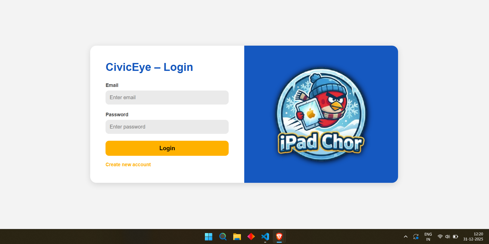
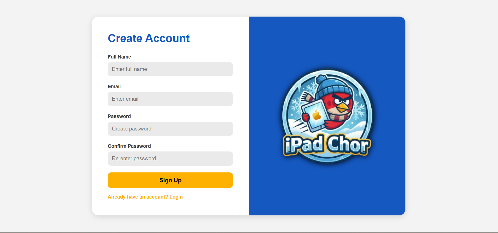
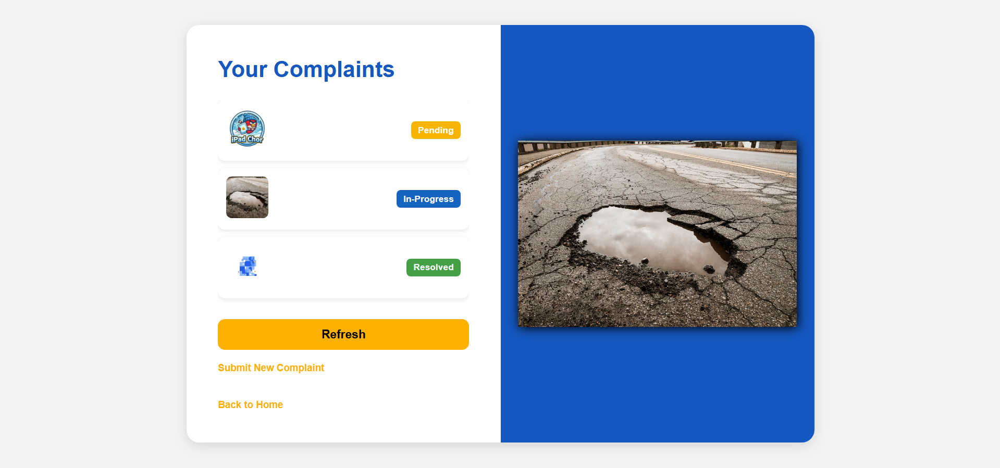

#  CivicEye – Smart Civic Issue Reporting Platform

CivicEye is a web-based civic infrastructure reporting system that empowers citizens to submit road defects (potholes, garbage, leakage etc.) and enables authorities to track, verify, and resolve them efficiently.

This prototype demonstrates:

 Citizen portal (Submit complaints + View status)  
 Admin portal (Manage complaints + Update resolution stage)  
 Data persistence using SQLite  
 Simulated AI validation pipeline 

---

##  Problem Statement
Even though our cities are becoming "Smart," the way we report and fix basic issues like potholes or garbage is still stuck in the past. There is a huge gap between what citizens see on the road and what authorities actually know.

- Most people see a problem (like a broken pipe or a pile of trash) and want to help, but they don't know where to go. Traditional helplines are confusing and visiting government offices is a waste of time. Because the process is so difficult, most issues never get reported.

- Even if someone manages to file a complaint, they have no idea what’s happening with it. There is no way to track if someone is working on it or if it has been ignored. This lack of transparency makes citizens lose trust in the system.

- On the other side, municipal offices are buried under paperwork. Without a proper digital dashboard, they can’t tell which issue is urgent and which one is a duplicate. This leads to a mess where resources are wasted on the wrong things.

- Because the information moves so slowly from a citizen to the actual repair team, a small pothole often turns into a massive crater by the time someone arrives to fix it. This delay doesn't just cost more money; it leads to accidents and puts lives at risk.

Our Solution: CivicEye
We built CivicEye to bridge this gap. We wanted to make reporting a civic issue as easy as posting a photo on social media. By connecting citizens directly to an admin dashboard, we make sure that every complaint is seen, tracked, and fixed—fast.

---

##  Core Features
| Feature | Citizen Web | Admin Panel |
|--------|-------------|-------------|
| Login / Register | ✅ |  Private |
| Submit complaint (image + details) | ✅ | — |
| View complaint status | ✅ | — |
| Dashboard showing all complaints | — | ✅ |
| Change status (Pending → In-Progress → Resolved) | — | ✅ |
| Persistent storage (SQLite) |  Automatic |  Automatic |
| AI Validation (Confidence score) |  ✅ |  ✅ |

---

---

### System Architecture


---

### Admin Complaint Management Flow


---

### User Flow Diagram


---

### Screenshot
##### Login Page


##### Register Page



##### Complain Page


##### Status Page



##### Admin Portal


---


---

##  Tech Stack
```
1️Frontend (User Interface)

Purpose:
This is what users and admins see in the browser.

Technologies used:

**HTML**

Creates page structure

Forms, buttons, input fields, tables

**CSS**

Page design and layout

Colors, spacing, alignment

Makes pages look clean

**JavaScript
**
Handles button clicks

Sends data to backend (complaints, login, status)

Fetches data from backend using fetch()

Updates page without reload

Used for:

Citizen login & register

Complaint submission form

Admin dashboard

Showing complaint status

**Backend (Server Side Logic)**

Purpose:
Handles requests, processes data, talks to database.

Technology used:

Python

Main programming language

Easy to read and maintain

Flask (Python Framework)

Lightweight web framework

Creates API routes (URLs)

Connects frontend and database

Backend responsibilities:

Accept login & register requests

Receive complaint data

Store data in database

Send complaint status to frontend

Update status by admin

API Layer (Communication)

Purpose:
Connects frontend and backend.

Technology used:

REST API (via Flask)

Uses HTTP methods:

GET → fetch data

POST → send data

PUT → update status

JSON

Data format for communication

Easy to send and read
**
Database
**
Purpose:
Stores all project data.

Technology used:
**
SQLite
**
File-based database

No server needed

Stored as .db file

Stores:

User details (citizens, admins)

Complaints

Complaint status

Image path / metadata

Why SQLite:

Simple

Perfect for college projects

Easy to migrate later to MySQL/PostgreSQL

**AI / Validation Logic (Current Status)
**
Purpose:
Check complaint validity.

Current implementation:

Simulated AI score

No real machine learning model

Just logic-based or random scoring

Future scope:

Can add YOLO / CNN

Image-based pothole or garbage detection

Python ML integration possible

**Image Handling
**
Purpose:
Handle uploaded complaint images.

Technology used:

HTML file input

Flask handles image upload

Stored locally in project folders

**Development & Tools**

Git & GitHub

Version control

Code sharing

VS Code

Code editor

Browser

Chrome / Edge for testing

**Project Type Summary
**
Web Application

Client–Server architecture

Frontend + Backend separated

Database-driven

AI-ready (future upgrade)

---
```

##  Repository Structure

```
CivicEye/
│
|── Diagrams/
│ ├── Admin-Complaint-Management-Flow.png
│ ├── System-Architecture.png
│ ├── User-Flow-Diagram.png
|
├── Screenshots/
│ ├── Admin-Portal.png
│ ├── Complain-Page.png
│ ├── Login-Page.png
│ ├── Register-Page.png
│ └── Status-Pages.png
|
├── backend/
│ ├── ai_engine.py
│ ├── app.py
│ ├── model.py
│ ├── requirements.txt
│ ├── server.py
│ └── utils.py
│
├── database/
| |── CivicEye_Database_schema.md
│ ├── ER Diagram.png
│ ├── civic_eye.db
│ └── schema.sql
|
├── .gitignore
├── README.md
├── README_Flow.md
└── README_Round2_Plan.md
```
---
##  Installation & Setup (Prototype)

### 1️ Install Dependencies
```bash
pip install flask flask-cors
```
### 2️ Run Server
```bash
 python -m flask --app backend.server run --debug
```
### 3️ Open HTML files
```bash
frontend/index.html  → Citizen Login

frontend/admin.html  → Admin Dashboard
```

---

##  Team "iPad Chor" – GEHU Bhimtal

| Name         | Role                 |
| ------------ | -------------------- |
| Tarun Ruwali | Frontend Web Dev     |
| Jay Negi     | AI / ML              |
| Ankush   Rawat    | Backend & Database   |
| Ujjwal  Bhatt     | Tester / UI Details  |

---

##  Why CivicEye is Impactful

CivicEye is more than just an app or a website. It’s about making our cities feel like home again. Here’s how it actually changes things for a common man:

- We’ve all seen that one pothole that stays there for months until someone gets hurt. CivicEye changes that. Instead of waiting for a miracle, a citizen reports it, and it reaches the right officer instantly. Faster fixes mean safer roads for our families.

- Usually, when we complain, we feel like our voice is lost. We never know if anyone even read it. With CivicEye, you can see the progress of your complaint on your screen. When people see things getting fixed, they start trusting the system again.

- Sometimes, authorities want to work but they don't know where to start. Our dashboard shows them a "map of problems." For example, if 20 people report a leak in the same area, the government knows there is a big pipe issue. This helps them spend our tax money on the right things.

- Authorities get thousands of fake or repeated photos every day. Our AI filters out the "spam" and "fake" complaints automatically. This means the ground workers don't waste time on paperwork and can focus 100% on actually fixing the problems.

# The Big Idea
"CivicEye turns your smartphone into a tool for change. It makes looking after our city a teamwork between the people and the government, rather than just a struggle."
